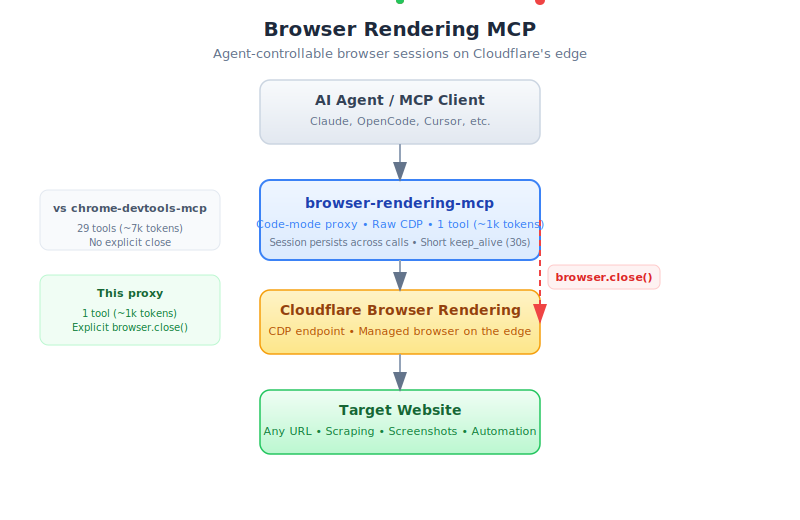

# Browser Rendering MCP

[](https://www.npmjs.com/package/browser-rendering-mcp)
[](https://opensource.org/licenses/MIT)

An [MCP](https://modelcontextprotocol.io) server that gives AI agents direct, code-mode control over [Cloudflare Browser Rendering](https://developers.cloudflare.com/browser-rendering/) sessions.

The big idea: **one tool, raw CDP, explicit lifecycle control.** Instead of 29 browser tools cluttering the agent's context, the agent writes a small async JS function. Instead of sessions idling for 10 minutes because there's no close affordance, `browser.close()` tears the remote browser down immediately.

<p align="center">
  
</p>

## Why this exists

The [official docs](https://developers.cloudflare.com/browser-rendering/platform/playwright/) suggest running [`chrome-devtools-mcp`](https://github.com/ChromeDevTools/chrome-devtools-mcp) locally with `--wsEndpoint` pointed at Browser Rendering. That works, but has two ergonomic problems:

1. **No way to end a session.** `chrome-devtools-mcp` holds the WebSocket open for the lifetime of the MCP server process, and there is no agent-invokable `Browser.close` tool. Your BR session stays alive until the `keep_alive` timer (default 10 min) expires.
2. **29 tools in the agent's context** (~7k tokens), many of which duplicate what a small block of JS could do.

This server fixes both:

- **Agent-controllable lifecycle.** `browser.close()` sends the CDP `Browser.close` command. Cloudflare's CDP backend treats that as a teardown signal, so the remote session goes away immediately.
- **Short default `keep_alive` (30s)** so forgotten sessions do not idle for 10 min.
- **One tool** (~1k tokens) exposing a `browser` object in code-mode. The agent writes a small async arrow function, the server runs it, and it gets back whatever the function returns.
- **Raw CDP.** No Puppeteer, no Playwright. The `browser.send(method, params)` escape hatch lets the agent call any CDP command directly.

## Quick start

### 1. Get a Cloudflare API token

[Create one here](https://dash.cloudflare.com/profile/api-tokens) using the **"Browser Rendering – Edit"** template. You also need your [account ID](https://dash.cloudflare.com/) (top-right of any account page).

### 2. Install

```bash
npm install -g browser-rendering-mcp
```

Or run directly with `npx` (no install):

```bash
CF_ACCOUNT_ID=xxx CF_API_TOKEN=yyy npx browser-rendering-mcp
```

### 3. Wire into your MCP client

#### Claude Desktop / Claude Code

Add to `claude_desktop_config.json` or `~/.claude.json`:

```json
{
  "mcpServers": {
    "browser-rendering": {
      "command": "npx",
      "args": ["browser-rendering-mcp"],
      "env": {
        "CF_ACCOUNT_ID": "your-account-id",
        "CF_API_TOKEN": "your-api-token"
      }
    }
  }
}
```

#### OpenCode

Add to `~/.config/opencode/opencode.jsonc`:

```jsonc
{
  "mcp": {
    "browser-rendering": {
      "type": "local",
      "command": ["npx", "browser-rendering-mcp"],
      "env": {
        "CF_ACCOUNT_ID": "your-account-id",
        "CF_API_TOKEN": "your-api-token"
      },
      "enabled": true
    }
  }
}
```

#### Cursor

Add to `~/.cursor/mcp.json`:

```json
{
  "mcpServers": {
    "browser-rendering": {
      "command": "npx",
      "args": ["browser-rendering-mcp"],
      "env": {
        "CF_ACCOUNT_ID": "your-account-id",
        "CF_API_TOKEN": "your-api-token"
      }
    }
  }
}
```

## How it works

The server exposes two MCP tools:

### `br_browser`

The main tool. The agent passes a string of JavaScript — an async arrow function that receives a `browser` object:

```js
async (browser) => {
  await browser.navigate('https://example.com');
  const title = await browser.title();
  const shot = await browser.screenshot();
  await browser.close();  // <-- tear down immediately
  return { title, screenshotBytes: shot.base64.length };
}
```

The `browser` object API:

| Method | Description |
| --- | --- |
| `navigate(url, { waitUntil?, timeoutMs? })` | Load a URL. `waitUntil` is `'load'` (default) or `'domcontentloaded'`. |
| `reload({ ignoreCache? })` | Reload the current page. |
| `evaluate(expression, { returnByValue?, awaitPromise? })` | Run JS in the page. |
| `title()` / `url()` / `content()` | Get page metadata. |
| `screenshot({ format?, quality?, fullPage? })` | Capture screenshot. Returns `{ format, base64 }`. |
| `click(selector, { button?, clickCount? })` | Click via CSS selector. |
| `type(text, { delay? })` | Type text into the focused element. |
| `close()` | **Send CDP `Browser.close`, end the BR session immediately.** |
| `connected()` | Boolean — is the CDP WebSocket open? |
| `debugLog(limit?)` | Recent CDP traffic for debugging. |
| `send(method, params, { sessionId? })` | Raw target-scoped CDP command. |
| `sendBrowser(method, params)` | Raw browser-scoped CDP command (`Browser.*`, `Target.*`). |

### `close_br_browser`

A top-level escape hatch. If the agent loses track of state and can't invoke `browser.close()` inside code, calling this tool directly tears the session down. Safe to call if no session is open.

## Session lifecycle

```
First br_browser call  →  Lazy-connect to BR CDP endpoint  →  Page session created
Subsequent calls       →  Reuse existing WebSocket          →  State persists
browser.close()        →  Send Browser.close CDP command    →  Server tears down immediately
Agent forgets to close →  Idle timeout (30s default)        →  Auto-cleanup by BR backend
```

## Environment variables

| Variable | Default | Notes |
| --- | --- | --- |
| `CF_ACCOUNT_ID` | **required** | Your Cloudflare account ID. |
| `CF_API_TOKEN` | **required** | Token with **Browser Rendering – Edit** permission. |
| `BR_KEEP_ALIVE_MS` | `30000` | Idle timeout. Shorter = less waste if the agent forgets to close. |
| `BR_CDP_URL` | `wss://api.cloudflare.com/client/v4/accounts/{id}/browser-rendering/devtools/browser` | Override for staging or custom CDP proxies. |

## Comparison

| | `chrome-devtools-mcp` + `--wsEndpoint` | This server |
| --- | --- | --- |
| Tool count | 29 | 2 (`br_browser`, `close_br_browser`) |
| Agent can end session | No | Yes, `browser.close()` |
| Default idle before teardown | 10 min | 30 sec |
| Raw CDP access | No | Yes, `browser.send()` |
| Context size | ~7k tokens | ~1k tokens |

## Troubleshooting

**`Unexpected server response: 401`** — your API token does not have Browser Rendering – Edit permission. Create a new token using that template.

**`Unexpected server response: 429`** — you have hit the Browser Rendering concurrent session limit for your account. Close other sessions or wait.

**Session stays alive after the agent finishes** — make sure the agent calls `browser.close()` at the end of each workflow, or invoke `close_br_browser` directly. If that's not possible, lower `BR_KEEP_ALIVE_MS`.

## Development

```bash
git clone https://github.com/jonnyparris/browser-rendering-mcp.git
cd browser-rendering-mcp
npm install
CF_ACCOUNT_ID=... CF_API_TOKEN=... npm run smoke
```

## License

MIT
